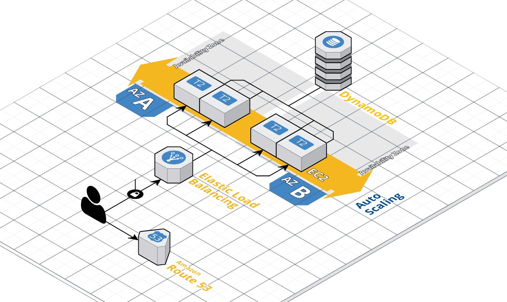

This is a basic Flask application that implements two simple REST methods (GET, PUT) on top of AWS infrastructure.



## Prerequisites
You will need to below resources configured:

#### AWS Account:
A non-administrative user with the following permissions is required:

1. AmazonEC2FullAccess, AmazonDynamoDBFullAccess

2. In order to pass this role to EC2 instances, your AWS user will need the PassRole permissions. This document shows you how to set it up: 
<a href="https://docs.aws.amazon.com/IAM/latest/UserGuide/id_roles_use_switch-role-ec2.html#roles-usingrole-ec2instance-permissions" target="_blank">Permissions Required for Using Roles with Amazon EC2</a>

3. The EC2 instances need access to DynamoDB. You can use the same role as in step 1, or one with just AmazonDynamoDBFullAccess. Either way, the "Instance Profile ARN" of the role must be entered in the ansible variables file.

#### Ansible control machine
4. Required packages:
ansible, boto, python-virtualenv (if you rather use a virtual env)

  AWS credentials of user defined in step 1 must be added to
~/.aws/credentials

5. A test dataset is not automatically created. To test the application, create a DynamoDB table and add some data. You can do this on the same machine, with the json files included in this repository:
```
aws dynamodb create-table --cli-input-json file://create-table.json
aws dynamodb batch-write-item --request-items file://batch-write.json
```

## Provision the AWS infrastructure with Ansible
You will need to run the Ansible scripts on a control machine (laptop or VM)

Verify the variables in ansible/group-vars/variables.yml
There is no AMI mapping per regions, so the playbook will only work in eu-central-1 (Frankfurt) region.

To provision the infrastructure:
```
ansible-playbook -v ansible/playbooks/aws_deploy_playbook.yml
```
The last output will give you the DNS Name of the Load Balancer on which the application can be tested.

## Testing the application

Performing a GET to retrieve the date of birth of a user:
```
curl -X GET http://devops-challenge-lb-<some_name>.amazonaws.com/hello/John
{
  "message": "Hello, John! Your birthday is in 59 days."
}
```
Changing the date of birth:
```
curl -X PUT http://devops-challenge-lb-<some_name>.amazonaws.com/hello/John  \
-H 'content-type: application/json' \
-d '{"dateOfBirth": "15-12-1976"}'
```
Checking that the data has indeed changed. This can also be checked in DynamoDB in the AWS console.
```
curl -X GET http://devops-challenge-lb-<some_name>.amazonaws.com/hello/John
{
  "message": "Hello, John! Happy birthday!"
}
```

## Destroy the AWS infrastructure
```
ansible-playbook -v ansible/playbooks/aws_destroy_playbook.yml -e state=absent
```
